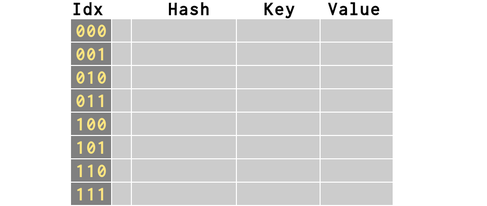

.. include:: <s5defs.txt>

>>> import my_inspect
>>> from timeit import timeit
>>> def bits(n):
...    sign = '1' if n < 0 else '0'
...    m = n if n >= 0 else (n + 2**31)
...    s = '%31s' % bin(m)[2:][-31:]
...    return sign + s.replace(' ', '0')
>>> print bits(1)
00000000000000000000000000000001
>>> print bits(-1)
11111111111111111111111111111111

::

 # All timeit() metrics were performed with
 # Python 2.6 as packaged on Ubuntu 9.10, and
 # run on my 2GHz Dell Latitude D630.

The Mighty Dictionary
=====================

:Author: Brandon Craig Rhodes
:Occasion: PyCon Atlanta
:Date: February 2010

untitled
========

| **Q:** How can Python lists access
| every one of their items
| with equal speed?

::

 timeit('mylist[0]', 'mylist = [1] * 9000')
 # --> 0.053692102432250977
 #     ~50 ns per getitem

 timeit('mylist[7000]', 'mylist = [1] * 9000')
 # --> 0.051460027694702148
 #     ~50 ns per getitem

untitled
========

| **A:** Python lists use segments of RAM
| and RAM acts like a Python list (!)

* RAM is a vast array
* Addressed by sequential integers
* Its first address is zero!

untitled
========

 | If the list begins at RAM address 336,
 | Python can jump to item *i* simply
 | by computing (336 + 4 × *i*)

::

                Real RAM Addresses

  335       340       345       350       355
 -------------------------------------------------
  | |0|1|2|3|.|.|.|.|.|.|.|.|.|.|.|.|0|1|2|3| | |
 -------------------------------------------------
     ^-----^ ^-----^ ^-----^ ^-----^ ^-----^
       [0]     [1]     [2]     [3]     [4]

         Python List Items (4 bytes each)

The Dictionary
==============

| Uses *keys* instead of *indexes*
| and keys can be almost *anything*

>>> d = {
...    'Brandon': 35,
...    3.1415: 'pi',
...    'flickr.com': '68.142.214.24',
...    (2, 6, 4): 'Python version',
...    }

The Three Rules
===============

| **#1** A Dictionary is really a List

untitled
========

>>> # An empty dictionary is an 8-element list!
>>> d = {}

The Three Rules
===============

| **#2** Keys are *hashed* to produce indexes

untitled
========

| Python lets you see hashing
| in action through the builtin hash()

>>> for key in 'Monty', 3.1415, (2, 6, 4):
...     print bits(hash(key)), key
01100111100110010110110011111110 Monty
01101010101011010000100100000010 3.1415
01000111010110111010001100110111 (2, 6, 4)

untitled
========

| Quite similar values often have
| very different hashes

>>> k1 = bits(hash('Monty'))
>>> k2 = bits(hash('Money'))
>>> diff = ('^ '[a==b] for a,b in zip(k1, k2))
>>> print k1; print k2; print ''.join(diff)
01100111100110010110110011111110
01100110101101001000101011101001
       ^  ^ ^^ ^^^^  ^^    ^ ^^^

untitled
========

| Hashes look crazy, but the *same* value
| always returns the *same* hash!

>>> for key in 3.1415, 3.1415, 3.1415:
...     print bits(hash(key)), key
01101010101011010000100100000010 3.1415
01101010101011010000100100000010 3.1415
01101010101011010000100100000010 3.1415

untitled
========

>>> # Python uses the lowest 3 hash bits
>>> # since the dictionary has 8 elements
>>> print bits(hash('ftp'))[-3:]
001
>>> d['ftp'] = 21

.. image:: figures/insert1.png

untitled
========

>>> print bits(hash('ssh'))[-3:]
101
>>> d['ssh'] = 22

.. image:: figures/insert2.png

untitled
========

>>> [ bits(hash(s))[-3:] for s
...   in 'smtp','time','www' ]
['100', '111', '010']
>>> d['smtp'] = 25
>>> d['time'] = 37
>>> d['www'] = 80

.. image:: figures/insert5.png

untitled
========

>>> # Lookup simply uses the hash too
>>> print bits(hash('smtp'))[-3:]
100
>>> print d['smtp']
25

.. image:: figures/insert5.png

The Three Rules
===============

| **#3** If at first you do not succeed,
| try, try again

A Question of Space
===================

| The rules:

.. class:: incremental

| When dictionary exceeds 5 elements, size ×4
| When dictionary exceeds ⅔ full, size ×4
| When len > 50k entries, factor is ×2

A Question of Space
===================

| Q: Why allow so much extra space?

.. class:: incremental

| A: To make gambling safer.

The Gamble
==========

| The dictionary is based on a gamble.

.. class:: incremental

| The above example worked so well
| because the last three digits of the hashes
| *happened* to be distinct

.. class:: incremental

| What if they were not?

The Gamble
==========

| What if we try adding these keys to a dict?

| ``'The' 'sassy' 'Dane' 'pranced' 'showily'``

.. class:: incremental

| When a key arrives whose slot is already taken,
| the dictionary has experienced a *collision*

Stupid Dictionary Trick #1
==========================

>>> d = {}
>>> for i in range(0, 681*1024, 1024):
...     d[i] = None

x>>> timeit('d[0]', 'd=%r' % d)
x>>> timeit('d[680*1024]', 'd=%r' % d)

Real-life collisions
====================

A dictionary of common words:

>>> wfile = open('/usr/share/dict/words')
>>> words = wfile.read().split()[:1365]
>>> print words
['A', "A's", ..., "Backus's", 'Bacon', "Bacon's"]

We can examine which keys collide:

>>> pmap = my_inspect.probe_all_steps(words)

untitled
========

Some keys are in the first slot probed:

>>> pmap['Ajax']
[1330]
>>> pmap['Agamemnon']
[2020]

While some keys collided several times:

>>> pmap['Aristarchus']  # requires 5 probes
[864, 1089, 801, 1108, 74]
>>> pmap['Baal']         # requires 16 probes!
[916, 1401, 250, 1359, 399, 1156, 1722, 420, 53,
 266, 1331, 512, 513, 518, 543, 668]

untitled
========

.. image:: figures/average_probes.png

untitled
========

But probes are very fast

>>> setup = "d=dict.fromkeys(%r)" % words
>>> fast = timeit("d['Ajax']", setup)
>>> slow = timeit("d['Baal']", setup)
>>> '%.1f' % (slow/fast)
'1.7'

untitled
========

.. image:: figures/average_time.png

Stupid Dictionary Trick #2
==========================

x>>> class Seven(object):
x...     def __hash__(self): return 7
x>>> sevens = [ Seven() for i in range(681) ]
x>>> d = dict([ (seven, None) for seven in sevens ])
x>>> timeit('d[0]', 'd=%r' % d)
x>>> timeit('d[680*1024]', 'd=%r' % d)

Collisions
==========

| Only the first key with a given hash value
| gets to live in that slot

.. class:: incremental

| Every subsequent key gets placed in another slot

.. class:: incremental

| When you look up one of the later keys,
| the dictionary has to look through every
| previous key involved in the collision
| before it finds the one you want

Collisions
==========

| When a hash table is given *more*
| space in which to hold *n* items,

.. class:: incremental

| collisions are *fewer,*

.. class:: incremental

| inserts happen *faster,*

.. class:: incremental

| and lookups cost *less*.

The Gamble
==========

| So *the gamble* is that by taking extra room
| the dictionary will provide you with nearly
| instantaneous results.

Iteration
=========

| When you iterate over a dictionary,
| it steps in order through its hash table

Iteration
=========

| **Consequence #1.** Triggering a dictionary resize
| can change the order of existing elements

 >>> d = {'Double': 1, 'double': 2, 'toil': 3, 'and': 4, 'trouble': 5}
 >>> d.keys()
 ['toil', 'Double', 'and', 'trouble', 'double']
 >>> d['fire'] = 6
 >>> d.keys()
 ['and', 'fire', 'Double', 'double', 'toil', 'trouble']

Iteration
=========

| **Consequence #2.** The dictionary could lose its place
| an add or remove caused a resize during iteration, so it
| refuses the change with a ``RuntimeError``

 >>> d = {'Double': 1, 'double': 2, 'toil': 3, 'and': 4, 'trouble': 5}
 >>> for key in d:
 ...     d['fire'] = 6
 ... 
 Traceback (most recent call last):
   File "<stdin>", line 1, in <module>
 RuntimeError: dictionary changed size during iteration

Iteration
=========

| **Consequence #3.** Because collisions move keys
| away from their natural hash values, key order
| is sensitive to dictionary history

 >>> d = {'Double': 1, 'double': 2, 'toil': 3, 'and': 4, 'trouble': 5}
 >>> d.keys()
 ['toil', 'Double', 'and', 'trouble', 'double']
 >>> e = {'Double': 1, 'double': 2, 'and': 4, 'toil': 3, 'trouble': 5}
 >>> e.keys()
 ['and', 'Double', 'trouble', 'toil', 'double']
 >>> d == e
 True

Iteration
=========

| **Consequence #4.** If a dictionary has
| been recently resized, its key order will
| have been reordered even if it is now equal

 >>> d = {'Double': 1, 'double': 2, 'toil': 3, 'and': 4, 'trouble': 5}
 >>> e = dict(d)
 >>> e['fire'] = 6
 >>> del e['fire']
 >>> d.keys()
 ['toil', 'Double', 'and', 'trouble', 'double']
 >>> e.keys()
 ['and', 'Double', 'double', 'toil', 'trouble']

Iteration
=========

| *Ergo:* a dictionary cannot guarantee the order
| in which you encounter its keys when iterating

Small dictionaries
==================

| If you keep thousands of small dictionaries,
| the wasted space can become significant

Small dictionaries
==================

| Instead, try using a tuple with index constants
| or, in Python 2.6, a namedtuple

::

 x>>> mytuple = ('Brandon', 35)
 x>>> print mytuple[NAME], 'is', mytuple[AGE]
 Brandon is 35

Objects and their dicts
=======================

| Normal objects have a ``__dict__`` dictionary
| in which their instance attributes are stored

.. class:: incremental

| To avoid the overhead of using a dictionary,
| you can specify ``__slots__`` for your class

Hashing your own classes
========================

| Normally, each instance of a user class
| is given a unique hash value, so that no
| two instances will look like the same key

::

 >>> class C(object): pass
 ... 
 >>> c1 = C()
 >>> c2 = C()
 >>> d = {c1: 1, c2: 2}

Hashing your own classes
========================

| But what if your class instances represent *values*
| that could be equal to one another?

.. class:: incremental

| Then equal values will deserve
| to be treated as the same key!

Hashing your own classes
========================

| Think of the two steps
| that a dictionary must take
| with each object offered as a key

Hashing your own classes
========================

| **First,** give your class a ``__hash__()`` method
| that returns a reasonable integer hash

.. class:: incremental

| **Second,** give your class an ``__eq__()`` method
| with which the dictionary

Hashing your own classes
========================

::

 class Point(object):
     def __init__(self, x, y):
         self.x, self.y = x, y

     def __eq__(self, p):
         return self.x == p.x and self.y == p.y

     def __hash__(self):
         return hash(self.x) ^ hash(self.y)

The End
=======

Other material
==============

When does it contract?

How much time does malloc take?  Both on going bigger and smaller!

How much time does it take to look up collided objects?

Measure wasted space!
 - Normally
 - When it contracts to very small

import my_inspect
d = {1:1, 2:2, 3:3, 4:4, 5:5, 6:6}
my_inspect.display_dictionary(d)

- make steps of dictionary lookup clearer at beginning (HASH then COMPARE)
- at end, show how to repackage dictionary (how?)
- mention not to do the __hash__/__eq__ trick with mutable objects
- talk about how setdefault() does only one lookup
- show how space is used (and wasted) for several ranges of dict size
- why dummy keys? because you could remove something from the middle of
  a collision search sequence!

.. raw:: html

  
