.. include:: <s5defs.txt>

>>> import my_inspect
>>> from timeit import timeit
>>> def bits(n):
...    sign = '1' if n < 0 else '0'
...    m = n if n >= 0 else (n + 2**31)
...    s = '%31s' % bin(m)[2:][-31:]
...    return sign + s.replace(' ', '0')
>>> print bits(1)
00000000000000000000000000000001
>>> print bits(-1)
11111111111111111111111111111111

::

 # All timeit() metrics were performed with
 # Python 2.6 as packaged on Ubuntu 9.10, and
 # run on my 2GHz Dell Latitude D630.

The Mighty Dictionary
=====================

:Author: Brandon Craig Rhodes
:Occasion: PyCon Atlanta
:Date: February 2010

untitled
========

| **Q:** How can Python lists access
| every one of their items
| with equal speed?

::

 timeit('mylist[0]', 'mylist = [1] * 9000')
 # --> 0.053692102432250977
 #     ~50 ns per getitem

 timeit('mylist[7000]', 'mylist = [1] * 9000')
 # --> 0.051460027694702148
 #     ~50 ns per getitem

untitled
========

| **A:** Python lists use segments of RAM
| and RAM acts like a Python list (!)

* RAM is a vast array
* Addressed by sequential integers
* Its first address is zero!
* Easy to implement a list atop memory

The Dictionary
==============

| Uses *keys* instead of *indexes*
| and keys can be almost anything

>>> d = {
...    'Brandon': 35,
...    3.1415: 'pi',
...    'flickr.com': '68.142.214.24',
...    (2, 6, 4): 'Python version',
...    }

untitled
========

| How can we turn
| the *keys* dictionaries use
| into *indexes* that reach memory fast?

The Three Rules
===============

| **#1 A dictionary is really a list**

untitled
========

>>> # An empty dictionary is an 8-element list!
>>> d = {}

.. image:: figures/insert0.png

untitled
========

>>> # Can call it a “list” of “items”
>>> # or a “hash table” with “slots”

.. image:: figures/insert0.png

The Three Rules
===============

| **#1** A dictionary is really a list

| **#2 Keys are hashed to produce indexes**

untitled
========

| Python lets you see hashing
| in action through the hash() builtin

>>> for key in 'Monty', 3.1415, (2, 6, 4):
...     print bits(hash(key)), key
01100111100110010110110011111110 Monty
01101010101011010000100100000010 3.1415
01000111010110111010001100110111 (2, 6, 4)

untitled
========

| Quite similar values often have
| very different hashes

>>> k1 = bits(hash('Monty'))
>>> k2 = bits(hash('Money'))
>>> diff = ('^ '[a==b] for a,b in zip(k1, k2))
>>> print k1; print k2; print ''.join(diff)
01100111100110010110110011111110
01100110101101001000101011101001
       ^  ^ ^^ ^^^^  ^^    ^ ^^^

untitled
========

| Hashes look crazy, but the *same* value
| always returns the *same* hash!

>>> for key in 3.1415, 3.1415, 3.1415:
...     print bits(hash(key)), key
01101010101011010000100100000010 3.1415
01101010101011010000100100000010 3.1415
01101010101011010000100100000010 3.1415

Keys and Indexes
================

| To build an index, Python uses
| the bottom *n* bits of the hash

untitled
========

>>> d['ftp'] = 21

>>> b = bits(hash('ftp'))
>>> print b
11010010011111111001001010100001
>>> print b[-3:]  # last 3 bits = 8 combinations
001

.. image:: figures/insert1a.png

untitled
========

>>> d['ftp'] = 21

>>> b = bits(hash('ftp'))
>>> print b
11010010011111111001001010100001
>>> print b[-3:]  # last 3 bits = 8 combinations
001

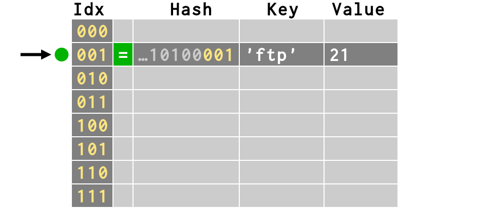

untitled
========

>>> d['ssh'] = 22

>>> print bits(hash('ssh'))[-3:]
101

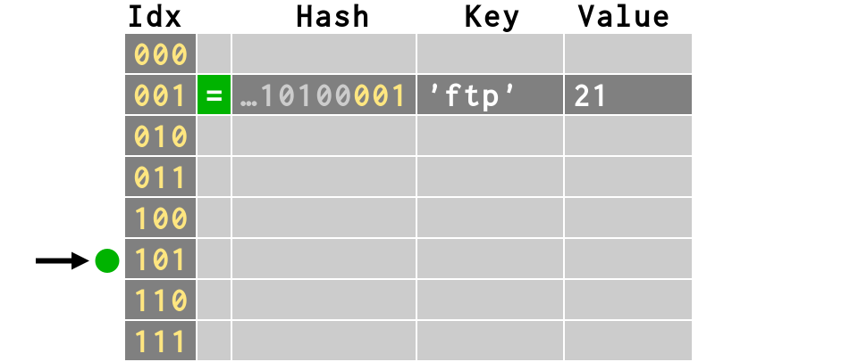

untitled
========

>>> d['ssh'] = 22

>>> print bits(hash('ssh'))[-3:]
101

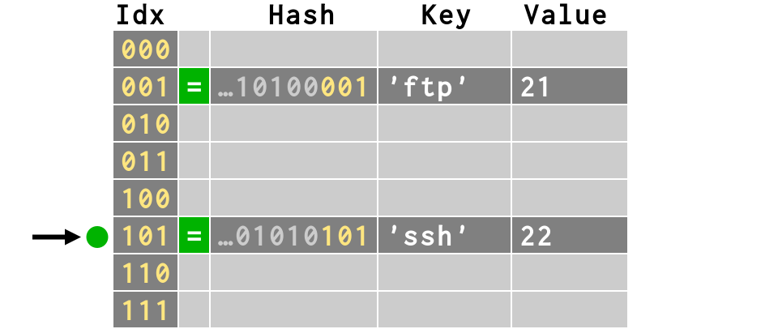

untitled
========

>>> d['smtp'] = 25

>>> print bits(hash('smtp'))[-3:]
100

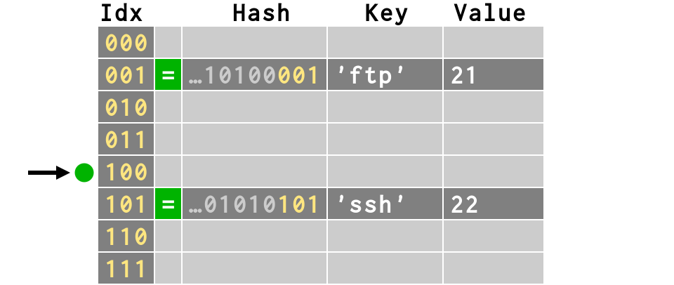

untitled
========

>>> d['smtp'] = 25

>>> print bits(hash('smtp'))[-3:]
100

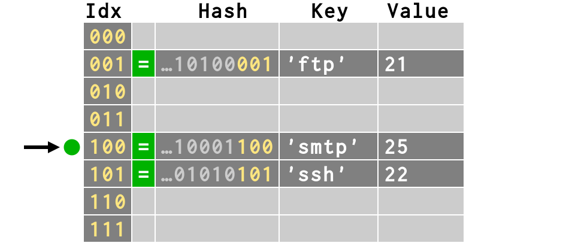

untitled
========

>>> d['time'] = 37

>>> print bits(hash('time'))[-3:]
111

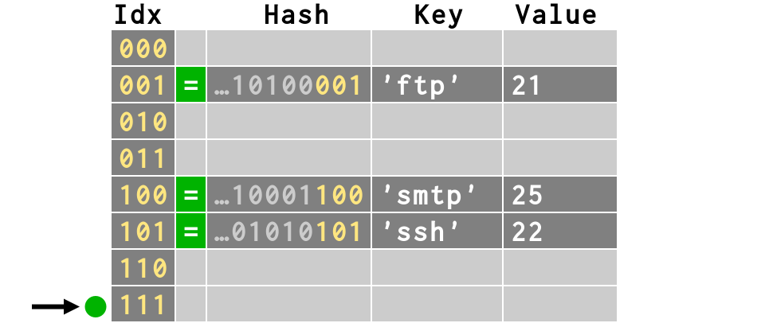

untitled
========

>>> d['time'] = 37

>>> print bits(hash('time'))[-3:]
111

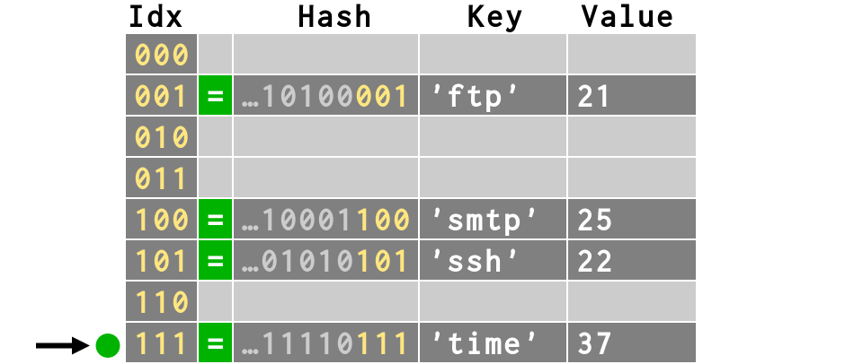

untitled
========

>>> d['www'] = 80

>>> print bits(hash('www'))[-3:]
010

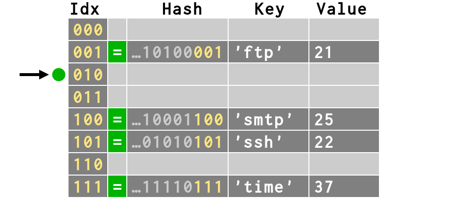

untitled
========

>>> d['www'] = 80

>>> print bits(hash('www'))[-3:]
010

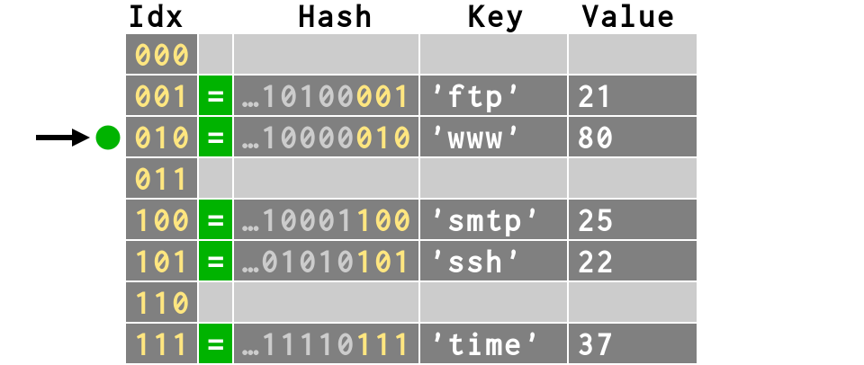

untitled
========

::

 d = {'ftp': 21, 'ssh': 22,
      'smtp': 25, 'time': 37,
      'www': 80}

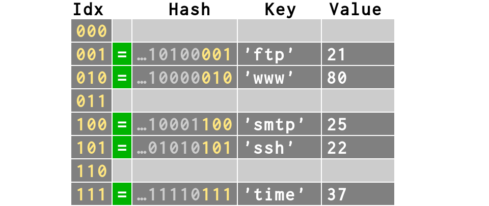

Lookup: same 3 steps
====================

* Compute the hash
* Truncate it
* Look in that slot

untitled
========

>>> print d['smtp']
25

>>> print bits(hash('smtp'))[-3:]
100

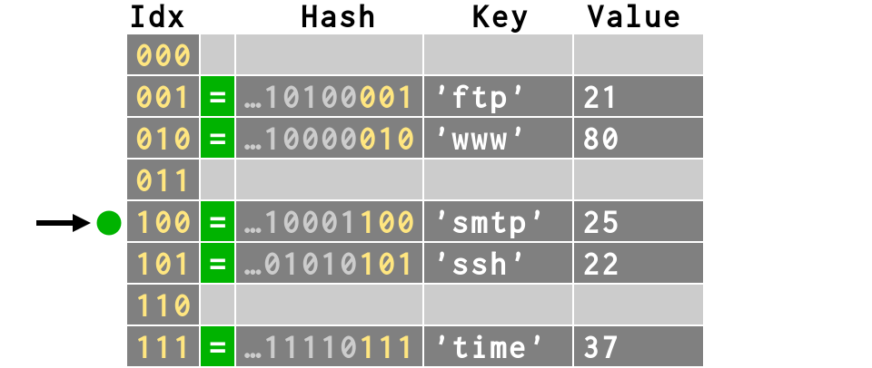

Consequence #1
==============

| Dictionaries tend to return their
| contents in a crazy order

untitled
========

>>> # Different than our insertion order:
>>> print d
{'ftp': 21, 'www': 80, 'smtp': 25, 'ssh': 22,
 'time': 37}
>>> # But same order as in the hash table!

untitled
========

>>> # keys and values also in table order
>>> d.keys()
['ftp', 'www', 'smtp', 'ssh', 'time']
>>> d.values()
[21, 80, 25, 22, 37]

The Three Rules
===============

| **#1** A dictionary is really a list
| **#2** Keys are *hashed* to produce indexes

| **#3 If at first you don't**
| **succeed, try, try again**

“Collision”
===========

| When two keys in a dictionary
| want the same slot

untitled
========

>>> # start over with a new dictionary
>>> d = {}

.. image:: figures/insert0.png

untitled
========

>>> # first item inserts fine
>>> d['smtp'] = 21

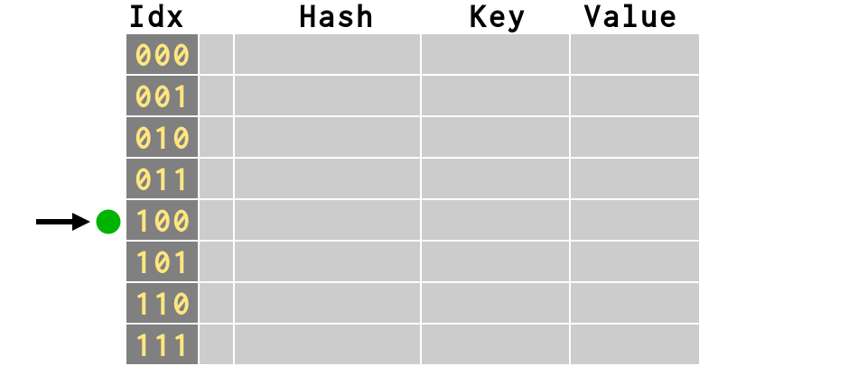

untitled
========

>>> # first item inserts fine
>>> d['smtp'] = 21

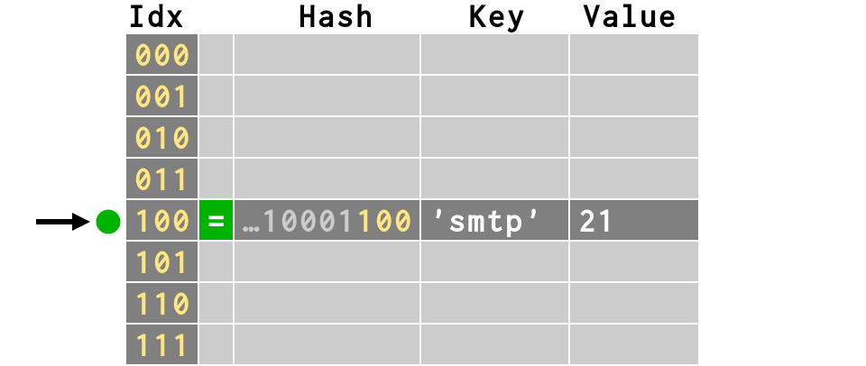

untitled
========

>>> # second item collides!
>>> d['dict'] = 2628

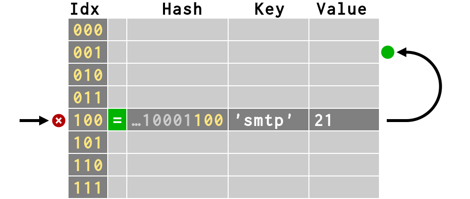

untitled
========

>>> # second item collides!
>>> d['dict'] = 2628

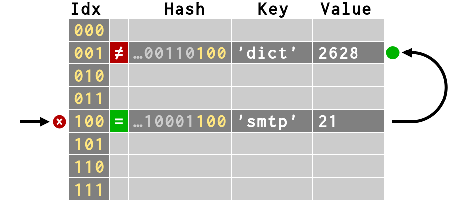

untitled
========

>>> # third item also finds empty slot
>>> d['svn'] = 3690

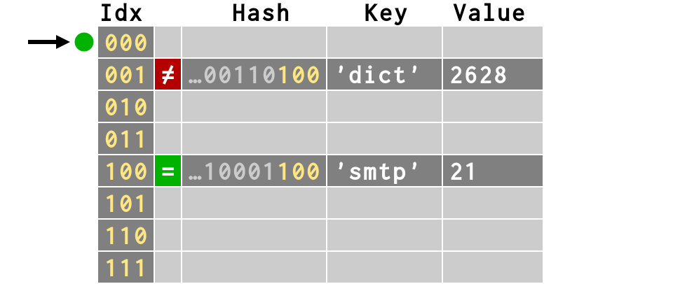

untitled
========

>>> # third item also finds empty slot
>>> d['svn'] = 3690

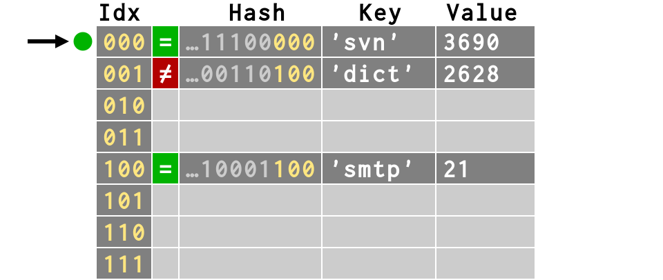

untitled
========

>>> # fourth item has multiple collisions
>>> d['ircd'] = 6667

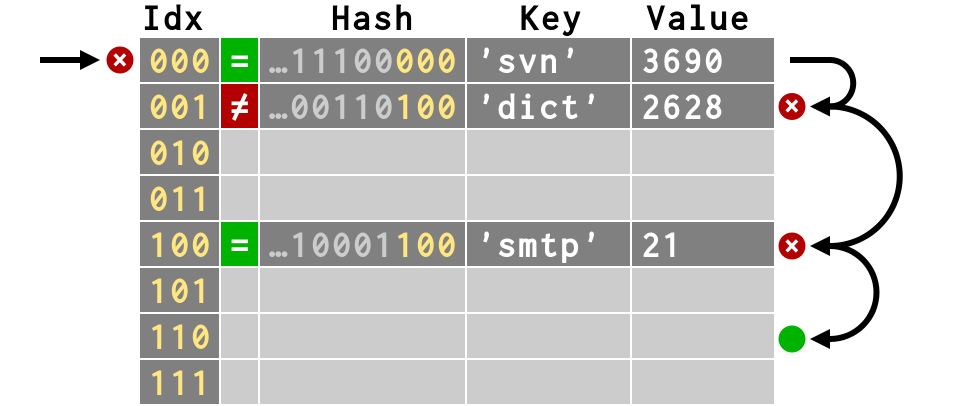

untitled
========

>>> # fourth item has multiple collisions
>>> d['ircd'] = 6667

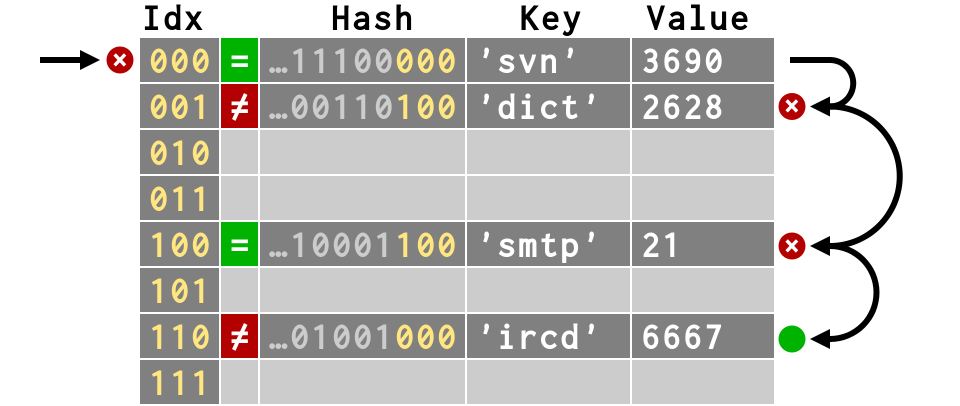

untitled
========

>>> # fifth item collides, but less deeply
>>> d['zope'] = 9673

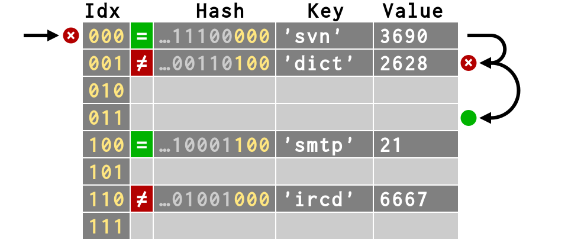

untitled
========

>>> # fifth item collides, but less deeply
>>> d['zope'] = 9673

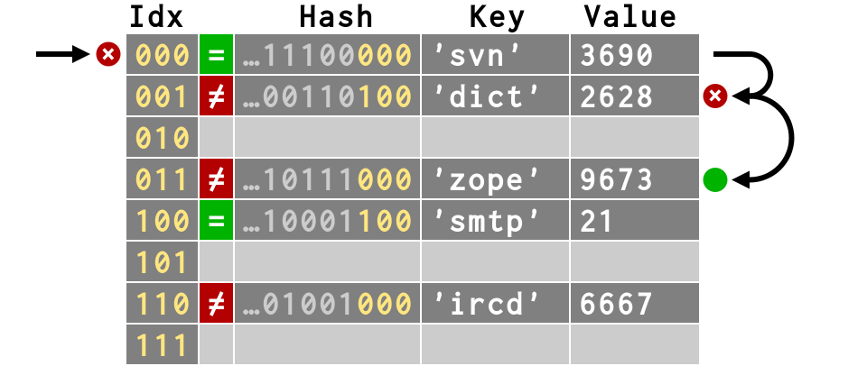

untitled
========

::

# Only ⅖ of the keys in this dictionary
# can be found in the right slot

Consequence #2
==============

| Because collisions move keys
| away from their natural hash values,
| key order is quite sensitive
| to dictionary history

 >>> d = {'Double': 1, 'double': 2, 'toil': 3, 'and': 4, 'trouble': 5}
 >>> d.keys()
 ['toil', 'Double', 'and', 'trouble', 'double']
 >>> e = {'Double': 1, 'double': 2, 'and': 4, 'toil': 3, 'trouble': 5}
 >>> e.keys()
 ['and', 'Double', 'trouble', 'toil', 'double']
 >>> d == e
 True

Consequence #3
==============

| The lookup algorithm is actually
| more complicated than
| “hash, truncate, look”

Consequence #3
==============

| It's more like “until you find
| an empty slot, keep looking,
| it could be here somewhere!”

untitled
========

>>> # Successful lookup, length 1
>>> d['svn']
3690

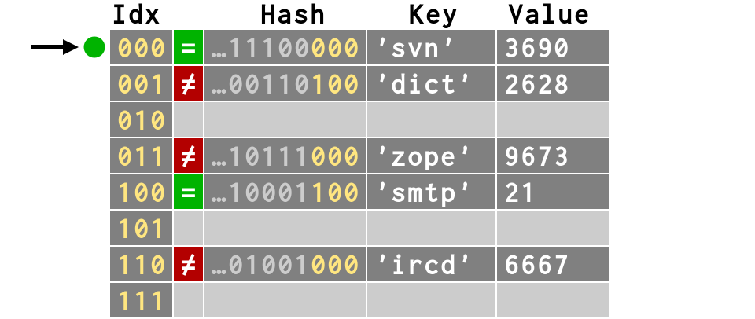

untitled
========

>>> # Successful lookup, length 4
>>> d['ircd']
6667

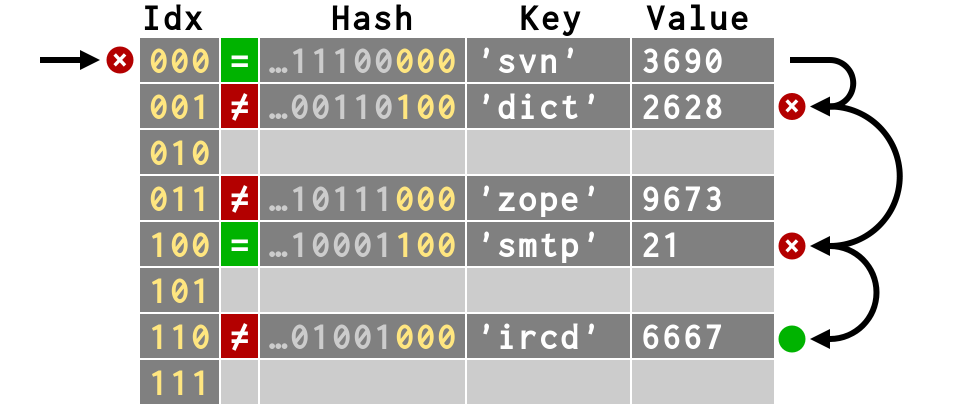

untitled
========

>>> # Unsuccessful lookup, length 1
>>> d['nsca']
Traceback (most recent call last):
  ...
KeyError: 'nsca'

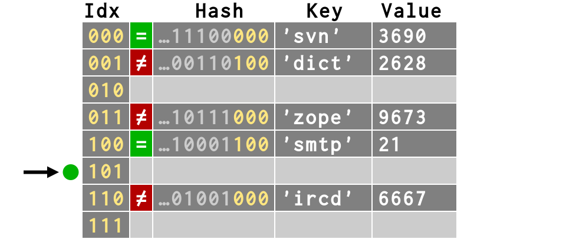

untitled
========

>>> # Unsuccessful lookup, length 4
>>> d['netstat']
Traceback (most recent call last):
  ...
KeyError: 'netstat'

.. image:: figures/collide5g.png

Consequence #4
==============

| Not all lookups are created equal.

.. class:: incremental

| Some finish at their first slot
| Some loop over several slots

Stupid Dictionary Trick #1
==========================

>>> d = {}
>>> for i in range(0, 681*1024, 1024):
...     d[i] = None

x>>> timeit('d[0]', 'd=%r' % d)
x>>> timeit('d[680*1024]', 'd=%r' % d)
FIX THE ABOVE

Consequence #5
==============

| When deleting a key,
| you need to leave
| “dummy” slots

untitled
========

::

 del d['smtp']

 # Can we simply make its slot empty?

.. image:: figures/collide5c.png

untitled
========

::

 del d['smtp']

 # But what would happen to d['ircd']?

untitled
========

| When a key is deleted,
| its slot *cannot* simply
| be marked as empty

.. class:: incremental

| Otherwise, any keys
| that collided with it would
| now be impossible to find!

.. class:: incremental

| So we create a dummy key instead

untitled
========

>>> # Creates a <dummy> slot that
>>> # can be re-used as storage

>>> del d['smtp']

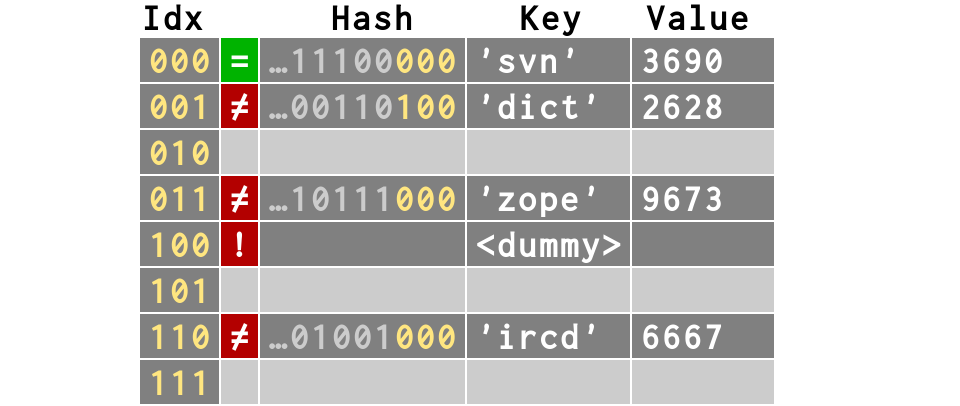

untitled
========

>>> # That way, we can still find d['ircd']

>>> d['ircd']
6667

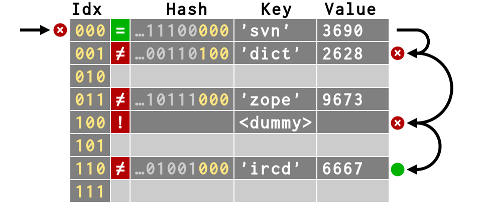

Stupid Dictionary Trick #2
==========================

>>> del d['svn'], d['dict'], d['zope']
>>> d['ircd']
6667
>>> # Still requires 4 steps!

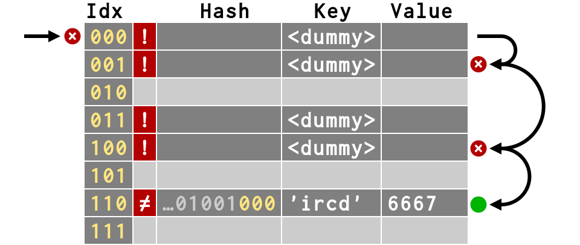

Optimization #1
===============

| Dicts refuse to get full

.. class:: incremental

| To keep collisions rare,
| dicts resize when only ⅔ full

.. class:: incremental

| When < 50k entries, size ×4
| When > 50k entries, size ×2

untitled
========

| Let's watch a dictionary in action
| against words pulled from the standard
| dictionary on my Ubuntu box

>>> wordfile = open('/usr/share/dict/words')
>>> text = wordfile.read().decode('utf-8')
>>> words = [ w for w in text.split()
...     if w == w.lower() and len(w) < 6 ]
>>> words
[u'a', u'abaci', u'aback', u'abaft', u'abase',
 ..., u'zoom', u'zooms', u'zoos', ...]

untitled
========

::

 d = {}
 # Again, an empty dict has 8 slots
 # Let's start filling it with keys

.. image:: figures/insert0.png

untitled
========

::

 d = dict.fromkeys(words[:5])
 # collision rate 40%
 # but now ⅔ full — on verge of resizing!

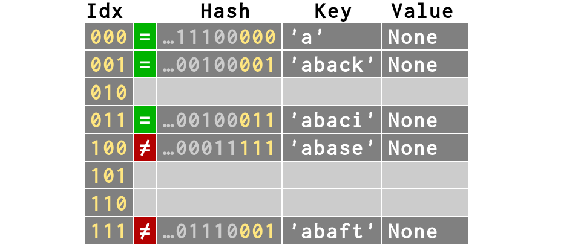

untitled
========

::

 d['abash'] = None
 # Resizes ×4 to 32, collision rate drops to 0% 

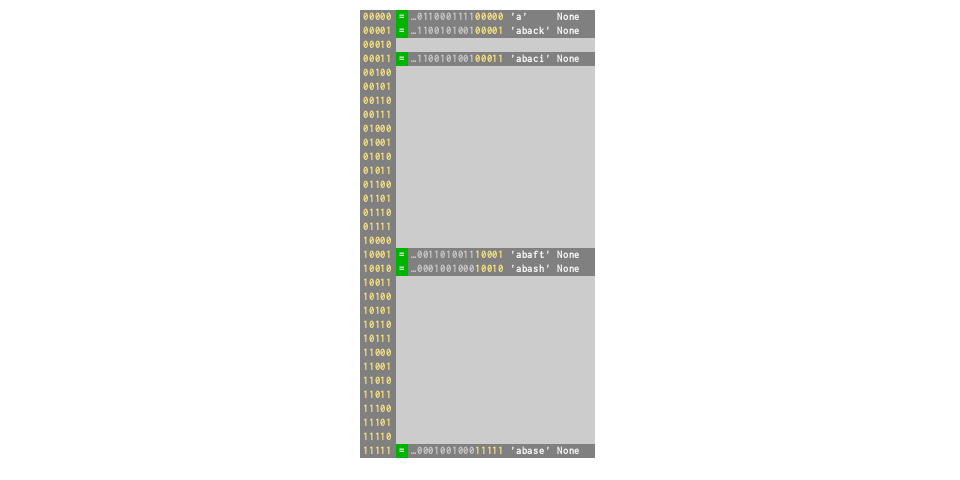

untitled
========

::

 d = dict.fromkeys(words[:21])
 # ⅔ full again — collision rate 29%

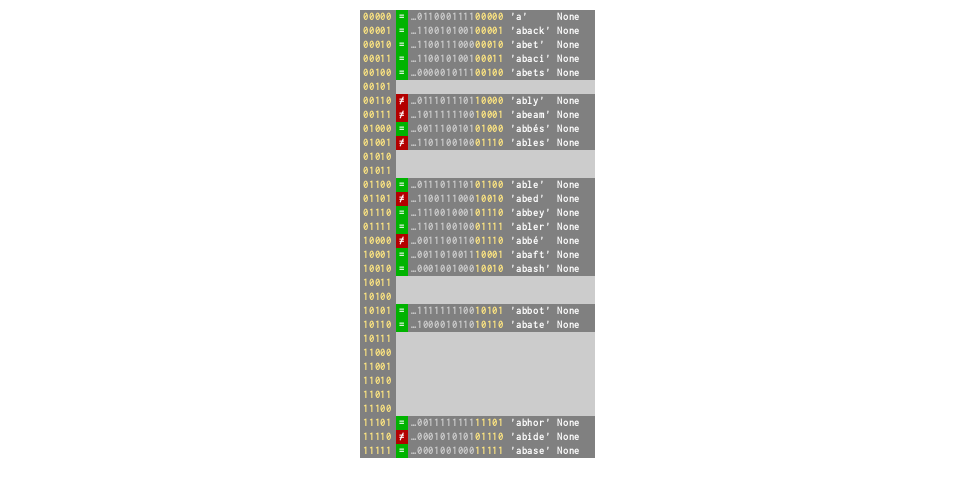

untitled
========

::

 d['abode'] = None
 # Resizes ×4 to 128, collision rate drops to 9%

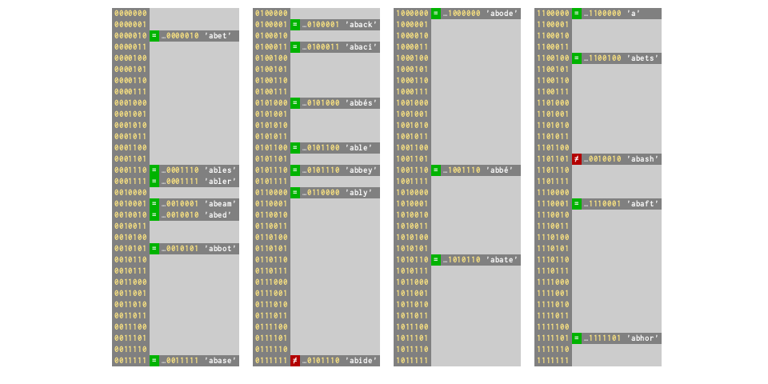

untitled
========

::

 d = dict.fromkeys(words[:85])
 # ⅔ full again — collision rate 33%

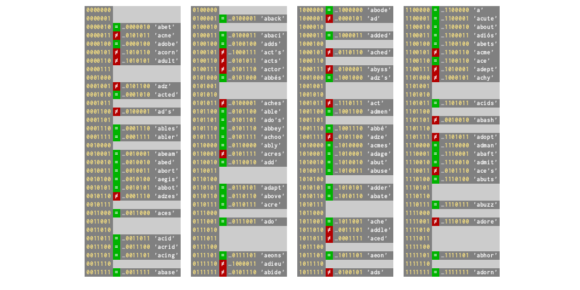

untitled
========

| Life cycle as dictionary fills:
| Gradually more crowded as keys are added
| Then suddenly less as dict resizes

Consequence #6
==============

| Average dictionary
| performance is excellent

Real-life collisions
====================

A dictionary of common words:

>>> wfile = open('/usr/share/dict/words')
>>> words = wfile.read().split()[:1365]
>>> print words
['A', "A's", ..., "Backus's", 'Bacon', "Bacon's"]

We can examine which keys collide:

>>> pmap = my_inspect.probe_all_steps(words)

untitled
========

Some keys are in the first slot probed:

>>> pmap['Ajax']
[1330]
>>> pmap['Agamemnon']
[2020]

While some keys collided several times:

>>> pmap['Aristarchus']  # requires 5 probes
[864, 1089, 801, 1108, 74]
>>> pmap['Baal']         # requires 16 probes!
[916, 1401, 250, 1359, 399, 1156, 1722, 420, 53,
 266, 1331, 512, 513, 518, 543, 668]

untitled
========

.. image:: figures/average_probes.png

untitled
========

But probes are very fast

>>> setup = "d=dict.fromkeys(%r)" % words
>>> fast = timeit("d['Ajax']", setup)
>>> slow = timeit("d['Baal']", setup)
>>> '%.1f' % (slow/fast)
'1.7'

untitled
========

.. image:: figures/average_time.png

Consequence #7
==============

| Because of resizing,
| a dictionary can completely reorder
| during an otherwise innocent insert

 >>> d = {'Double': 1, 'double': 2, 'toil': 3, 'and': 4, 'trouble': 5}
 >>> d.keys()
 ['toil', 'Double', 'and', 'trouble', 'double']
 >>> d['fire'] = 6
 >>> d.keys()
 ['and', 'fire', 'Double', 'double', 'toil', 'trouble']

Consequence #8
==============

| Because an insert can radically
| reorder a dictionary, key insertion
| is prohibited during iteration

 >>> d = {'Double': 1, 'double': 2, 'toil': 3, 'and': 4, 'trouble': 5}
 >>> for key in d:
 ...     d['fire'] = 6
 ... 
 Traceback (most recent call last):
   File "<stdin>", line 1, in <module>
 RuntimeError: dictionary changed size during iteration

Take-away #1
============

1. Don't rely on order
2. Don't insert while iterating
3. Can't have mutable keys

| The restrictions on dictionaries
| can seem arbitrary if you don't know
| how they work

Take-away #1
============

1. Don't rely on order
2. Don't insert while iterating
3. Can't have mutable keys

| Hopefully you now have a picture
| in your head that makes the
| restrictions make sense!

Take-away #2
============

| Dictionaries trade space for time

| If you need more space,
| there are alternatives

* Tuples or namedtuples (Python 2.6)
* Give classes ``__slots__``

Take-away #3
============

| If your class needs its own ``__hash__()``
| method you now know how hashes
| should behave

1. Scatter bits like crazy
2. Equal instances **must** have equal hashes
3. Must also implement ``__eq__()`` method
4. Make hash and equality quick!

| (You can often get away with ``^``
| all of the values inside the instance)

Hashing your own classes
========================

::

 class Point(object):
     def __init__(self, x, y):
         self.x, self.y = x, y

     def __eq__(self, p):
         return self.x == p.x and self.y == p.y

     def __hash__(self):
         return hash(self.x) ^ hash(self.y)

Take-away #4
============

The End
=======

Other material
==============

When does it contract?

How much time does malloc take?  Both on going bigger and smaller!

How much time does it take to look up collided objects?

Measure wasted space!
 - Normally
 - When it contracts to very small

import my_inspect
d = {1:1, 2:2, 3:3, 4:4, 5:5, 6:6}
my_inspect.display_dictionary(d)

- emphasize that hashes compared before objects
- when dicting your own object, make comparison fast!
- make steps of dictionary lookup clearer at beginning (HASH then COMPARE)
- at end, show how to repackage dictionary (how?)
- mention not to do the __hash__/__eq__ trick with mutable objects
- talk about how setdefault() does only one lookup
- show how space is used (and wasted) for several ranges of dict size
- why dummy keys? because you could remove something from the middle of
  a collision search sequence!

.. raw:: html

  
